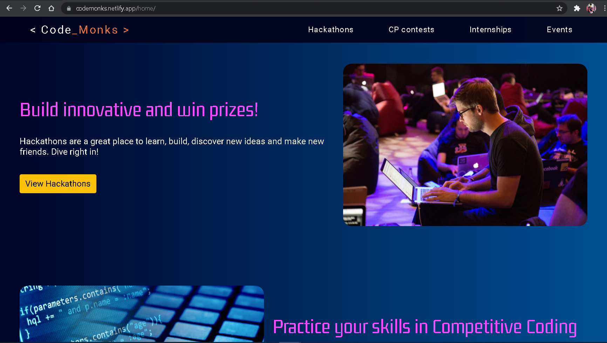
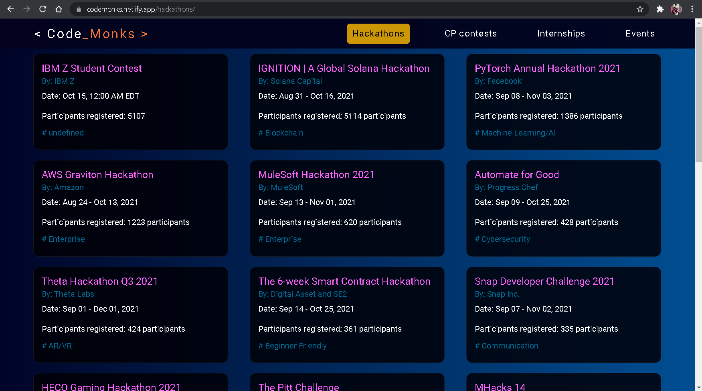

# Code Monks Web App  

   
 
  
## Problem Statement  
Students generally tend to miss major hackathons / events / contents and mainly the internship opportunities . Our project helps coding enthusiasts to keep track of all the major events on our website . We will try to build as user friendly website as possible.

## Idea  
A simple website that will tell and notify the users about the ongoing / present programs / contests / hackathons / internships related to the coding domain.  
Other website don’t cover all the coding related events. So, we  try to cover them in our website.  
We will also try to go through as many coding websites as possible to gather all the possible information on a single platform.

## Features
Will have information related to   
     1. Coding contests  
     2. Hackathons   
     3. Internships opportunities  
     4. Coding events  
     5. Student Community Programmes  

 

## Tech Stack Used  
**React.js**, **Node.js**, Gatsby, Bootstrap, React-bootstrap, JSON, Coil API, SawoLabs API

## Impact on society  
 1. Our project will impact the coding students who have the capability but aren’t able to get the best just because of missing some awesome opportunities. 
 2. Students who have just starting coding and are looking for hackathons to build  expertise,  and are already experienced coders who are looking for good internships or job opportunities . 

Demo Video - youtube.com/watch?v=c8OiU27Mh3A&list=LL
